  

# Hi there, I'm Luis Teles 👋

### 👨‍💻 About Me
* 🎓 **Computer Engineering Student** at Inatel.
* 💻 **Full-Stack Developer** at SOIL tecnologia.
* 🏗️ Focused on engineering scalable, data-driven applications.
* 🐳 Passionate about clean code, modular architecture, and utilizing containerized environments to ensure reliable deployments.
* 🎸 When I'm away from the keyboard, you can find me studying guitar.

### 🛠️ Tech Stack Icons

---

  

